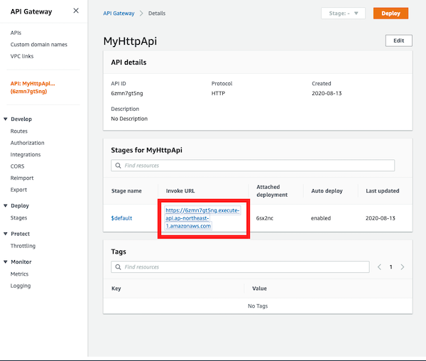

# A lambda function using CDK in Java

A Java example making AWS lambda function and then deploy using CDK.

# Requirements

- [The AWS CDK Toolkit](https://docs.aws.amazon.com/cdk/latest/guide/getting_started.html#getting_started_prerequisites)
- [Amazon Corretto 11](https://docs.aws.amazon.com/ja_jp/corretto/latest/corretto-11-ug/downloads-list.html)

# Usage

First of all, execute following commands:

```
cd cdk
cdk bootstrap
cdk synth
cdk deploy
```

Next, access to api-gateway page in AWS console, then click `Invoke URL`.



You will view a text `200 OK` on your browser.

# LICENSE

[MIT](./LICENSE)
